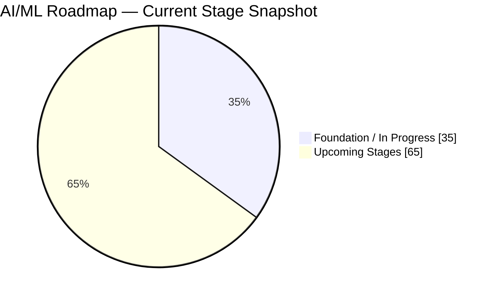
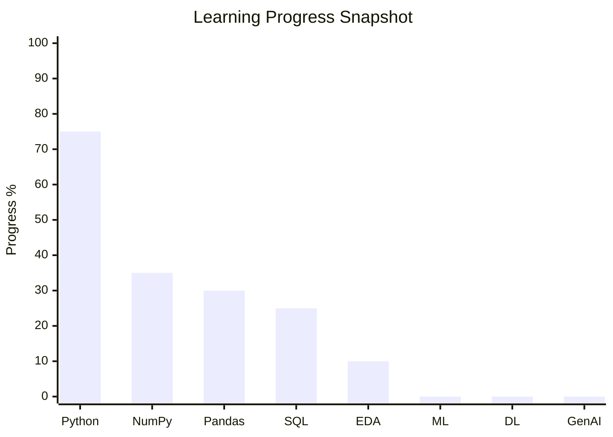
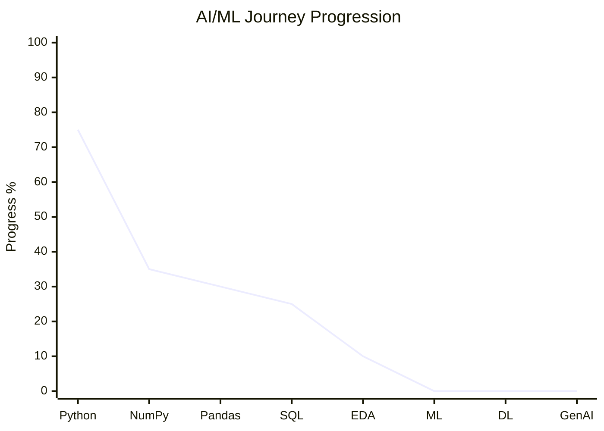
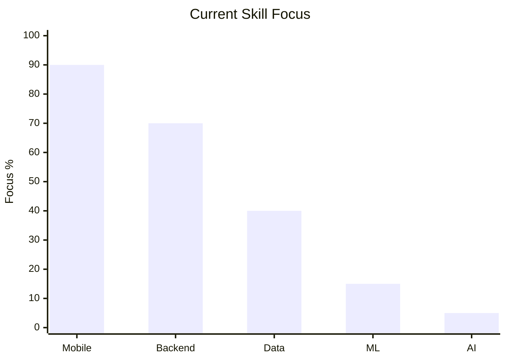

# GitHub README — Rohit Kumar

> **Dark • Red • Developer • AI/ML Journey • Dynamic Progress**

---

<div align="center">


<br/>

# 🔴 Hi 👋, I'm Rohit Kumar

### 📱 React Native Developer • Mobile Application Engineer • AI/ML Enthusiast


<br/>


<br/><br/>

<a href="https://github.com/rohit-kumar-fullstack">

</a>

<a href="https://www.linkedin.com/">

</a>

<br/><br/>


</div>

---

<div align="center">

## 🖤 REACT NATIVE • MOBILE • FULL STACK • AI 🔴

### Building modern, scalable and production-ready applications.

</div>

---

# 👨‍💻 About Me

I'm a **React Native Developer** with around **3 years of experience** building mobile and full-stack applications.

My primary focus is building cross-platform applications for Android and iOS with:

```text
⚡ Performance
🧩 Scalable Architecture
🎨 Modern UI / UX
🔌 API Integration
📱 Native Mobile Features
🚀 Production-Ready Applications
```

My current learning path is:

```text
Python
   ↓
Data Analytics
   ↓
Machine Learning
   ↓
Deep Learning
   ↓
Generative AI
```

---

# 🔥 Core Expertise

| Area | Technologies |
|---|---|
| 📱 Mobile | React Native, Expo, Android, iOS |
| ⚛️ Frontend | React, TypeScript, JavaScript |
| 🧭 Navigation | Stack, Tabs, Drawer, Deep Linking |
| 🌐 APIs | REST API, GraphQL, Axios |
| 💾 Data | TanStack Query, MMKV, SQLite |
| ⚡ Performance | FlashList, Memoization, Lazy Loading |
| 🎬 Animation | Reanimated, Gesture Handler, Lottie |
| 🔐 Security | Authentication, Secure Storage |
| 📍 Native | Camera, Location, Notifications, PiP |
| 🛒 Domains | E-Commerce, Fintech |
| 🤖 AI Journey | Data Analytics → ML → DL → GenAI |

---

# 📱 React Native Expertise

```text
                    ┌─────────────────────┐
                    │    REACT NATIVE     │
                    └──────────┬──────────┘
                               │
          ┌────────────────────┼────────────────────┐
          │                    │                    │
          ▼                    ▼                    ▼
   ┌──────────────┐     ┌──────────────┐     ┌──────────────┐
   │   UI / UX    │     │ NAVIGATION   │     │ PERFORMANCE  │
   ├──────────────┤     ├──────────────┤     ├──────────────┤
   │ Responsive   │     │ Stack        │     │ FlashList    │
   │ Components   │     │ Tabs         │     │ Memoization  │
   │ Themes       │     │ Drawer       │     │ Lazy Loading │
   │ Animations   │     │ Deep Links   │     │ Image Opt.   │
   │ Accessibility│     │ App Links    │     │ Native APIs  │
   └──────────────┘     └──────────────┘     └──────────────┘
          │                    │                    │
          └────────────────────┼────────────────────┘
                               ▼
                    ┌─────────────────────┐
                    │ PRODUCTION MOBILE   │
                    │     APPLICATIONS    │
                    └─────────────────────┘
```

---

# 🏗️ Production Architecture

```text
                         📱 APPLICATION
                              │
             ┌────────────────┴────────────────┐
             │                                 │
             ▼                                 ▼
      PRESENTATION                       BUSINESS LOGIC
             │                                 │
      ┌──────┼──────┐                  ┌───────┼───────┐
      ▼      ▼      ▼                  ▼       ▼       ▼
   Screens  UI    Styles             Hooks  Services  Utils
      │      │      │                  │       │       │
      └──────┴──────┴──────────────────┴───────┴───────┘
                              │
                              ▼
                       DATA / API LAYER
                              │
                ┌─────────────┼─────────────┐
                ▼             ▼             ▼
              REST          GraphQL        Cache
                │             │             │
                └─────────────┼─────────────┘
                              │
                              ▼
                     NATIVE / BACKEND
```

---

# 🎨 UI • UX • Animation

<div align="center">


</div>

---

# 🧰 Tech Stack

## 📱 Mobile Development

<div align="center">


</div>

## 🌐 Backend

<div align="center">


</div>

## 📊 Data & AI

<div align="center">


</div>

---

# 🚀 Advanced React Native

```text
╔══════════════════════════════════════════════════════════════════╗
║                  ADVANCED MOBILE FEATURES                       ║
╠══════════════════════════════════════════════════════════════════╣
║                                                                  ║
║  📺 Picture-in-Picture        🔔 Push Notifications             ║
║  📍 Location Tracking         📷 Camera Integration             ║
║  🗺️ Maps & Geolocation        🎥 Video Recording                ║
║  🔐 Biometric Authentication  💾 Secure Storage                 ║
║  📴 Offline-first Apps        🌐 Network Detection              ║
║  🔗 Deep Linking              🔄 Real-time Updates              ║
║  📦 File Upload / Download    🧩 Native Modules                ║
║  📳 Haptic Feedback            ⚙️ Kotlin Integration             ║
║  🎬 Advanced Animations        🚀 Performance Optimization      ║
║                                                                  ║
╚══════════════════════════════════════════════════════════════════╝
```

---

# 📊 Learning Progress Dashboard

> **Progress is represented as a roadmap-stage snapshot based on the current learning sequence, not as a measured skill score. Update the chart numbers whenever a stage is completed.**

## 🥧 Overall AI/ML Roadmap



## 📊 Current Learning Areas



## 📈 Roadmap Progression



## 🧱 Skill Areas



### Current Focus

```text
📱 React Native / Mobile       ██████████████████░░  90%
🌐 Backend / Node.js           ██████████████░░░░░░  70%
📊 Data Analytics              ████████░░░░░░░░░░░░  40%
🤖 Machine Learning            ███░░░░░░░░░░░░░░░░░  15%
✨ Generative AI               █░░░░░░░░░░░░░░░░░░░  05%
```

> **Note:** The percentages above are roadmap visualization values based on the current learning sequence and known focus areas. They are intentionally editable rather than claiming objectively measured proficiency.

---

# 📡 Data & State Management

```text
                         APPLICATION DATA
                                │
              ┌─────────────────┴─────────────────┐
              │                                   │
              ▼                                   ▼
        SERVER STATE                         LOCAL STATE
              │                                   │
       TanStack Query                         MMKV
              │                                   │
       ├── API Caching                    ├── Tokens
       ├── Pagination                     ├── Cart
       ├── Infinite Query                 ├── Search
       ├── Mutations                      └── Preferences
       └── Offline Support
```

---

# 🛒 Domain Experience

## 🛍️ E-Commerce

```text
PRODUCT
   │
   ├── Catalog
   ├── Details
   ├── Search
   ├── Filters
   └── Wishlist
   │
   ▼
CART
   │
   ├── Quantity
   ├── Coupons
   └── Persistence
   │
   ▼
CHECKOUT
   │
   ├── Address
   ├── Payment
   └── Order
   │
   ▼
DELIVERY
   │
   ├── Tracking
   └── Notifications
```

## 💳 Fintech

```text
AUTHENTICATION
       │
       ▼
ACCOUNT
       │
       ▼
TRANSACTIONS
       │
       ▼
SECURITY
       │
       ├── Secure Storage
       ├── Authentication
       └── Data Protection
       │
       ▼
REAL-TIME UPDATES
```

---

# 🧪 Featured Project

<div align="center">

# 🔴 NEXUS

### Advanced React Native Practice Application

**A production-style mobile application for exploring modern React Native capabilities.**

</div>

```text
╭──────────────────────────────────────────────────────────────────╮
│                           NEXUS                                  │
├──────────────────────────────────────────────────────────────────┤
│                                                                  │
│  📱 React Native       ⚡ Reanimated       🧩 Native Android     │
│  🟣 Expo               🔷 TypeScript       📺 PiP                │
│  📷 Camera             📍 Location         🔄 TanStack Query     │
│  💾 MMKV               📴 Offline          🚀 Performance        │
│                                                                  │
╰──────────────────────────────────────────────────────────────────╯
```

### NEXUS Development Flow

```text
Modern UI
    ↓
Animations
    ↓
Gestures
    ↓
API + Server State
    ↓
Offline Architecture
    ↓
Native Android
    ↓
Camera + Location
    ↓
Picture-in-Picture
    ↓
Performance Optimization
```

---

# 🤖 AI / ML Journey

```text
                 📱 React Native Developer
                              │
                              ▼
                    💻 Software Engineering
                              │
                              ▼
                         🐍 Python
                              │
                              ▼
                      📊 Data Analytics
                              │
               ┌──────────────┼──────────────┐
               ▼              ▼              ▼
              SQL           NumPy          Pandas
               │              │              │
               └──────────────┼──────────────┘
                              ▼
                       📈 Visualization
                              │
                              ▼
                            EDA
                              │
                              ▼
                    🤖 Machine Learning
                              │
                              ▼
                       🧠 Deep Learning
                              │
                              ▼
                      ✨ Generative AI
                              │
                              ▼
                       🚀 AI/ML Engineer
```

---

# 📚 Currently Learning

<div align="center">

```text
┌─────────────────────────────────────────────────────┐
│                                                     │
│  🐍 Python                                          │
│       ↓                                             │
│  📊 NumPy → Pandas → Visualization                 │
│       ↓                                             │
│  🗄️ SQL                                             │
│       ↓                                             │
│  🔎 EDA                                             │
│       ↓                                             │
│  🤖 Machine Learning                                │
│       ↓                                             │
│  🧠 Deep Learning                                   │
│       ↓                                             │
│  ✨ Generative AI                                   │
│       ↓                                             │
│  🚀 AI/ML Engineering                              │
│                                                     │
└─────────────────────────────────────────────────────┘
```

</div>

---

# 📊 GitHub Analytics

<div align="center">


</div>

---

# 🔥 Contribution Streak

<div align="center">


</div>

---

# 📈 Contribution Activity

<div align="center">


</div>

---

# 🏆 GitHub Trophies

<div align="center">


</div>

---

# 💻 Developer Mindset

```typescript
const rohit = {

  role: "React Native Developer",

  experience: [
    "Mobile Application Development",
    "E-Commerce",
    "Fintech",
    "Full-Stack Development"
  ],

  mobileStack: [
    "React Native",
    "TypeScript",
    "Expo",
    "React",
    "Kotlin"
  ],

  backendStack: [
    "Node.js",
    "Express.js",
    "MongoDB",
    "MySQL",
    "Redis"
  ],

  advancedFeatures: [
    "Picture-in-Picture",
    "Camera",
    "Location",
    "Push Notifications",
    "Deep Linking",
    "Native Modules"
  ],

  currentlyLearning: [
    "Data Analytics",
    "Machine Learning",
    "Artificial Intelligence"
  ],

  mindset: [
    "Build",
    "Ship",
    "Learn",
    "Improve"
  ],

  philosophy:
    "Build scalable products, understand the data, and keep learning."
};
```

---

# 🌐 Connect With Me

<div align="center">

<a href="https://github.com/rohit-kumar-fullstack">

</a>

<a href="https://www.linkedin.com/">

</a>

<br/><br/>


<br/><br/>

### 🖤 Code with purpose. Build with curiosity. 🔴

</div>

---

<div align="center">

# ⚡ BUILD → SHIP → LEARN → IMPROVE

<br/>


</div>
