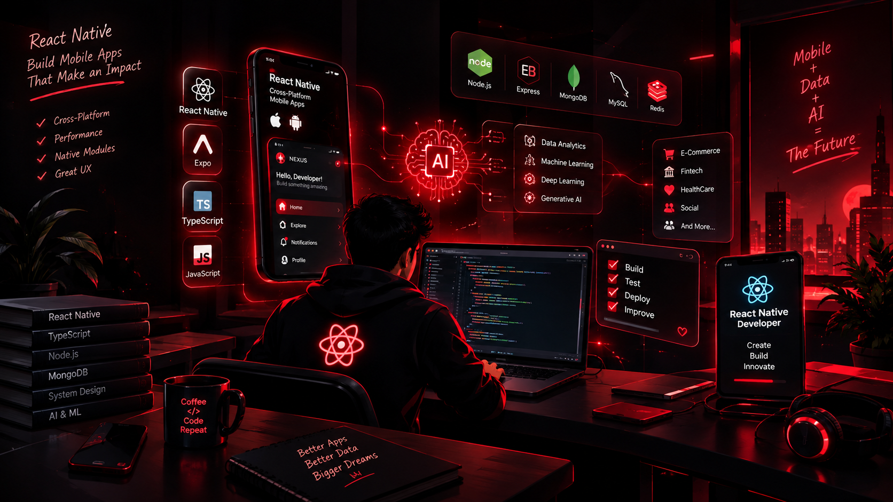

<div align="center">


  
<br/>


# 🔥 Hi 👋, I'm Rohit Kumar

### 📱 React Native Developer • Mobile Application Engineer • AI/ML Enthusiast


<br/>


</div>

---

<div align="center">

## 🚀 REACT NATIVE • MOBILE • FULL STACK • AI

### Building modern, scalable and production-ready applications.


</div>

---

# 👨‍💻 About Me

I'm a **React Native Developer** with around **3 years of experience** building mobile and full-stack applications.

My primary expertise is developing **cross-platform mobile applications for Android and iOS**, with a strong focus on performance, reusable architecture, API integration and modern user experiences.

### 🔥 Core Expertise

| Area          | Expertise                            |
| ------------- | ------------------------------------ |
| 📱 Mobile     | React Native, Expo, Android, iOS     |
| ⚛️ Frontend   | React, TypeScript, JavaScript        |
| 🧭 Navigation | Stack, Tabs, Drawer, Deep Linking    |
| 🌐 APIs       | REST API, GraphQL, Axios             |
| 💾 Data       | TanStack Query, MMKV, SQLite         |
| ⚡ Performance | FlashList, Memoization, Lazy Loading |
| 🎬 Animation  | Reanimated, Gesture Handler, Lottie  |
| 🔐 Security   | Authentication, Secure Storage       |
| 📍 Native     | Camera, Location, Notifications      |
| 🛒 Domains    | E-Commerce, Fintech                  |
| 🤖 AI Journey | Data Analytics → ML → DL → GenAI     |

---

# 📊 Skill Proficiency Chart

<div align="center">


</div>

---

# 📱 React Native Expertise

```text
                         ┌───────────────────────┐
                         │    REACT NATIVE       │
                         └───────────┬───────────┘
                                     │
          ┌──────────────────────────┼──────────────────────────┐
          │                          │                          │
          ▼                          ▼                          ▼
   ┌──────────────┐          ┌──────────────┐          ┌──────────────┐
   │   UI / UX    │          │ NAVIGATION   │          │ PERFORMANCE  │
   ├──────────────┤          ├──────────────┤          ├──────────────┤
   │ Responsive   │          │ Stack        │          │ FlashList    │
   │ Components   │          │ Tabs         │          │ Memoization  │
   │ Design System│          │ Drawer       │          │ Lazy Loading │
   │ Dark Theme   │          │ Deep Linking │          │ Optimization │
   │ Animations   │          │ Universal    │          │ Native       │
   │ Accessibility│          │ App Links    │          │ Modules      │
   └──────────────┘          └──────────────┘          └──────────────┘

          │                          │                          │
          └──────────────────────────┼──────────────────────────┘
                                     │
                                     ▼
                         ┌───────────────────────┐
                         │   PRODUCTION APPS    │
                         └───────────────────────┘
🎬 Animation & Interaction
text
Reanimated
    │
    ├── Shared Values
    ├── Layout Animations
    ├── Gesture Animations
    ├── Scroll Animations
    └── Interactive UI

Gesture Handler
    │
    ├── Pan
    ├── Swipe
    ├── Drag
    └── Gesture-driven UI
📡 Data & State
text
TanStack Query
      │
      ├── API Caching
      ├── Pagination
      ├── Infinite Queries
      ├── Offline Support
      └── Server State

MMKV
      │
      ├── Token Storage
      ├── Cart Persistence
      ├── Search State
      └── Local Preferences
🏗️ Mobile Architecture
I enjoy building applications using production-oriented architecture rather than simply creating screens.

text
                         📱 MOBILE APPLICATION
                                  │
                ┌─────────────────┴─────────────────┐
                │                                   │
                ▼                                   ▼
        ┌───────────────┐                   ┌───────────────┐
        │ PRESENTATION  │                   │ BUSINESS LOGIC│
        └───────┬───────┘                   └───────┬───────┘
                │                                   │
        ┌───────┴───────┐                   ┌───────┴───────┐
        │               │                   │               │
        ▼               ▼                   ▼               ▼
     Screens       Components            Services         Hooks
        │               │                   │               │
        └───────────────┴───────────────────┴───────────────┘
                                │
                                ▼
                       ┌──────────────────┐
                       │   DATA / API     │
                       └────────┬─────────┘
                                │
                   ┌────────────┼────────────┐
                   ▼            ▼            ▼
                 REST        GraphQL       Cache
                   │            │            │
                   └────────────┼────────────┘
                                ▼
                     Native / Backend Layer
🧰 React Native Tech Stack
⚛️ Frontend
https://img.shields.io/badge/React_Native-000000?style=for-the-badge&logo=react&logoColor=61DAFB
https://img.shields.io/badge/React-000000?style=for-the-badge&logo=react&logoColor=61DAFB
https://img.shields.io/badge/TypeScript-000000?style=for-the-badge&logo=typescript&logoColor=3178C6
https://img.shields.io/badge/JavaScript-000000?style=for-the-badge&logo=javascript&logoColor=F7DF1E
https://img.shields.io/badge/Expo-000000?style=for-the-badge&logo=expo&logoColor=FFFFFF

🧭 Navigation & UX
https://img.shields.io/badge/React_Navigation-000000?style=for-the-badge&logo=react&logoColor=61DAFB
https://img.shields.io/badge/Expo_Router-000000?style=for-the-badge&logo=expo&logoColor=FFFFFF

text
Stack
Tabs
Drawer
Nested Navigation
Deep Linking
Universal Links
Android App Links
Responsive UI
Dark Mode
Design Systems
Accessibility
🎨 Animation & Interaction
https://img.shields.io/badge/Reanimated-000000?style=for-the-badge&logo=react&logoColor=FF3030
https://img.shields.io/badge/Lottie-000000?style=for-the-badge&logo=lottiefiles&logoColor=00DDB3

text
Reanimated
Gesture Handler
Bottom Sheet
Lottie
Haptics
Interactive Animations
🌐 Networking & Data
text
REST API
Axios
TanStack Query
GraphQL
Caching
Pagination
Infinite Queries
Offline Support
💾 Storage
text
MMKV
AsyncStorage
SQLite
Secure Storage
🔥 Backend
https://img.shields.io/badge/Node.js-000000?style=for-the-badge&logo=node.js&logoColor=68A063
https://img.shields.io/badge/Express.js-000000?style=for-the-badge&logo=express&logoColor=FFFFFF
https://img.shields.io/badge/MongoDB-000000?style=for-the-badge&logo=mongodb&logoColor=47A248
https://img.shields.io/badge/MySQL-000000?style=for-the-badge&logo=mysql&logoColor=4479A1
https://img.shields.io/badge/Redis-000000?style=for-the-badge&logo=redis&logoColor=DC382D

📊 Tech Stack Distribution
<div align="center">
🥧 Language / Tech Usage (Pie)

📈 Weekly Coding Activity (Line)

📊 Domain Expertise (Horizontal Bar)
</div>
🚀 Advanced React Native Features
I'm actively practicing modern features that are commonly useful in production mobile applications.

text
                    ┌──────────────────────────┐
                    │     ADVANCED RN          │
                    └────────────┬─────────────┘
                                 │
       ┌─────────────────────────┼─────────────────────────┐
       │                         │                         │
       ▼                         ▼                         ▼

  📱 DEVICE                 🌐 CONNECTIVITY           🎬 MEDIA
  ─────────                 ──────────────            ─────────
  Picture-in-Picture       Deep Linking              Camera
  Background Tasks         Universal Links            Video Recording
  Push Notifications       Android App Links         File Upload
  Location Tracking        WebSockets                 PDF Generation
  Biometrics               Real-time Updates          Downloads
  Secure Storage           Offline Support            Haptics

       │                         │                         │
       └─────────────────────────┼─────────────────────────┘
                                 │
                                 ▼

                     ⚙️ NATIVE INTEGRATION
                     ─────────────────────
                     Kotlin
                     Native Modules
                     Background Location
                     Gesture-driven UI
                     Advanced Animations
                     Performance Optimization
🛒 Domain Experience
🛍️ E-Commerce
text
Product Catalog
      ↓
Product Details
      ↓
Search & Filtering
      ↓
Cart Management
      ↓
Wishlist
      ↓
Checkout
      ↓
Payment Integration
      ↓
Orders
      ↓
Delivery Tracking
💳 Fintech
text
Authentication
      ↓
Secure Data Handling
      ↓
Transaction Flows
      ↓
API Integration
      ↓
Account Dashboards
      ↓
Real-time Updates
      ↓
Secure Storage
🧪 Projects I'm Building
📱 NEXUS
Advanced React Native Practice Application
A production-style application where I'm experimenting with modern React Native capabilities.

text
┌─────────────────────────────────────────────┐
│                    NEXUS                    │
├─────────────────────────────────────────────┤
│                                             │
│  React Native      Expo        TypeScript   │
│                                             │
│  Reanimated        Native      PiP          │
│                                             │
│  Camera            Location    Offline      │
│                                             │
│  TanStack Query    MMKV        Architecture │
│                                             │
└─────────────────────────────────────────────┘
Focus Areas
https://img.shields.io/badge/React_Native-000000?style=flat-square&logo=react&logoColor=61DAFB
https://img.shields.io/badge/Expo-000000?style=flat-square&logo=expo&logoColor=FFFFFF
https://img.shields.io/badge/TypeScript-000000?style=flat-square&logo=typescript&logoColor=3178C6
https://img.shields.io/badge/Reanimated-000000?style=flat-square&logo=react&logoColor=FF3030

text
Native Android
Picture-in-Picture
Camera
Location
TanStack Query
MMKV
Offline Support
📊 Data Analytics Portfolio
Moving beyond application development into data-driven engineering.

text
Python
  │
  ├── SQL
  ├── NumPy
  ├── Pandas
  ├── Data Visualization
  ├── Statistics
  └── EDA
https://img.shields.io/badge/Python-000000?style=for-the-badge&logo=python&logoColor=3776AB
https://img.shields.io/badge/NumPy-000000?style=for-the-badge&logo=numpy&logoColor=013243
https://img.shields.io/badge/Pandas-000000?style=for-the-badge&logo=pandas&logoColor=150458
https://img.shields.io/badge/SQL-000000?style=for-the-badge&logo=mysql&logoColor=4479A1

🧠 My AI/ML Journey
text
┌──────────────────────────────┐
│    React Native Developer    │
└──────────────┬───────────────┘
               │
               ▼
┌──────────────────────────────┐
│    Software Engineering      │
└──────────────┬───────────────┘
               │
               ▼
┌──────────────────────────────┐
│           Python             │
└──────────────┬───────────────┘
               │
               ▼
┌──────────────────────────────┐
│       Data Analytics         │
│                              │
│ SQL • NumPy • Pandas         │
│ Visualization • EDA         │
└──────────────┬───────────────┘
               │
               ▼
┌──────────────────────────────┐
│     Machine Learning         │
└──────────────┬───────────────┘
               │
               ▼
┌──────────────────────────────┐
│       Deep Learning          │
└──────────────┬───────────────┘
               │
               ▼
┌──────────────────────────────┐
│       Generative AI          │
└──────────────┬───────────────┘
               │
               ▼
┌──────────────────────────────┐
│        AI/ML Engineer        │
└──────────────────────────────┘
📊 GitHub Analytics
<div align="center"></div>
🔥 Contribution Streak
<div align="center"></div>
📈 Contribution Activity
<div align="center"></div>
🏆 GitHub Trophies
<div align="center"></div>
🐍 Contribution Snake
<div align="center"><picture> <source media="(prefers-color-scheme: dark)" srcset="https://raw.githubusercontent.com/rohit-kumar-fullstack/rohit-kumar-fullstack/output/github-contribution-grid-snake-dark.svg"/> <source media="(prefers-color-scheme: light)" srcset="https://raw.githubusercontent.com/rohit-kumar-fullstack/rohit-kumar-fullstack/output/github-contribution-grid-snake.svg"/>  </picture></div>
💻 Developer Mindset
typescript
const rohit = {

    primaryRole: "React Native Developer",

    experience: [
        "Mobile Application Development",
        "E-Commerce",
        "Fintech",
        "Full-Stack Development"
    ],

    mobileStack: [
        "React Native",
        "TypeScript",
        "Expo",
        "React",
        "Kotlin"
    ],

    backendStack: [
        "Node.js",
        "Express.js",
        "MongoDB",
        "MySQL",
        "Redis"
    ],

    currentlyLearning: [
        "Data Analytics",
        "Machine Learning",
        "Artificial Intelligence"
    ],

    philosophy:
        "Build scalable products, understand the data, and keep learning."
};
🌐 Connect With Me
<div align="center"><a href="https://github.com/rohit-kumar-fullstack">  </a><a href="https://www.linkedin.com/">  </a><a href="mailto:your.email@example.com">  </a><a href="https://twitter.com/">  </a></div>
<div align="center">
⚡ BUILD → SHIP → LEARN → IMPROVE

</div> ```


